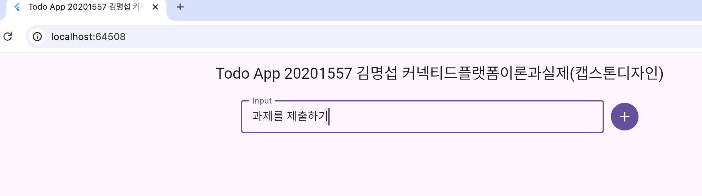

# TODO 과제
김명섭 20201557


## Getting Started
```bash
cd ./todo
```

```bash
flutter upgrade
```

```bash
flutter pub get
```

```bash
flutter run -d chrome
```

## 어떻게 짰는지 (구조) 설명

### 상태 관리 관련

#### 자료 구조

##### Todo 클래스
```flutter
class Todo {
  final String id;
  final String desc;
  final bool comp;


...

  Todo clone({String? id, String? desc, bool? comp}) {
    return Todo(
      id: id ?? this.id,
      desc: desc ?? this.desc,
      comp: comp ?? this.comp,
    );
  }
}
```
`@immutable` 데코레이터를 사용해서 변경은 불가능하나 clone을 사용해 새 객체를 선언하는 방식을 이용함. 속성은 `id`, `desc`, `comp`로 함.

`id`는 UUID를 기반으로 하여 관리됨.

#### TodoListNotifier
여기서 상태 관리 자체는 Riverpod의 `Notifier`를 이용해 `List<Todo>`의 상태를 관리하는 `TodoListNotifier`를 이용함. `todoListNotifierProvider`란 객체가 해당 클래스로 선언되며, 이를 통해 다른 위젯에서 읽고 호출하고 변경함.

### Widgets
- `main.dart` (`ProviderScope`)
    - 최상위 위젯임
- `home_screen.dart` (`HomeScreen`)
- `widgets/add_todo.dart` (`AddTodo`)
    - 추가 부분에 해당하는 위젯임.
- `widgets/todo_item.dart` (`TodoItem`)
    - 개별 항목에 해당하는 위젯임. 삭제도 여기에 구현이 되어 있음.
- `widgets/todo_list.dart` (`TodoList`)
    - 목록에 해당하는 위젯임.

## Bonus points
### Riverpod
- Riverpod의 Notifier 클래스 기반으로 상태를 관리함.

### DevTools 사용
#### Memory


#### Timeline


#### Performance


#### Inspector


## 기타 스크린샷
#### 추가


#### 목록


#### 삭제
